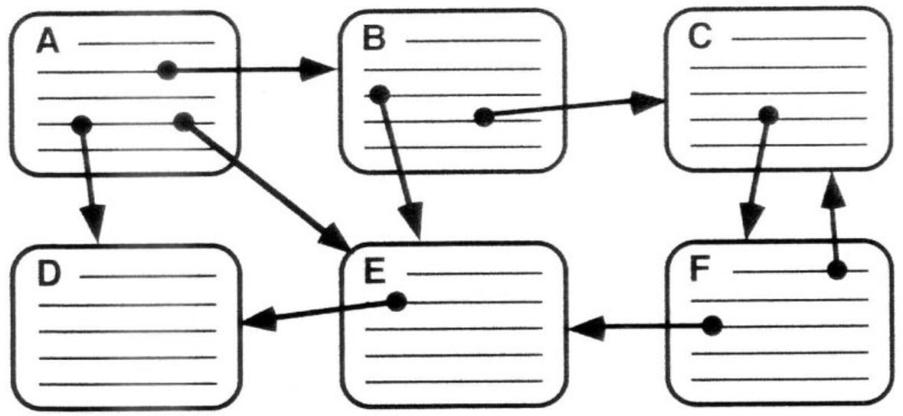
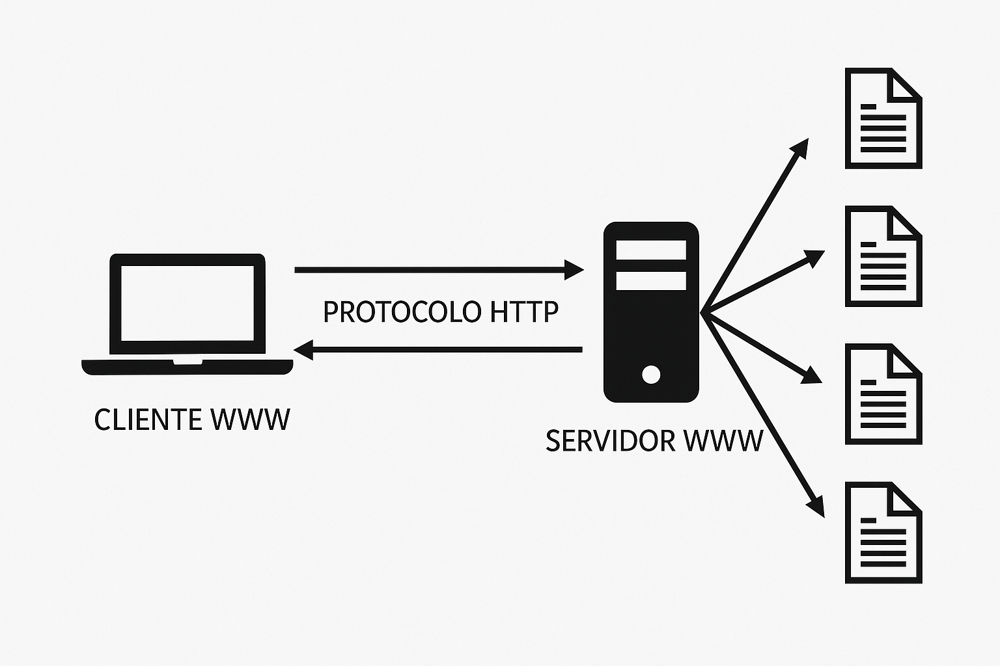

# Conocimientos Preliminares para Iniciar con Spring Boot

Bienvenido(a) al repositorio de inicio para estudiantes que comienzan su camino en Spring Boot. Antes de escribir tu primera línea de código en este potente framework, es importante que comprendas algunos conceptos clave. Aquí te los explicamos de forma clara, acompañados de ejemplos divertidos y visuales.

---

## 1. ¿Qué es HTTP y qué es un hipertexto?

**HTTP** (Hypertext Transfer Protocol) es el protocolo que permite la comunicación entre un cliente (como tu navegador) y un servidor web. A través de HTTP se intercambian mensajes que contienen hipertextos.

**Hipertexto** es cualquier texto que contiene enlaces a otros textos o recursos. Es la base de la navegación en la web.



Un hipertexto puede verse así:

```html
<p>Visita nuestra <a href="https://spring.io">página oficial de Spring</a> para más información.</p>
```

---

## 2. ¿Qué es el protocolo HTTP y cuáles son sus componentes?

HTTP es un protocolo de solicitud/respuesta:

- El **cliente** (por ejemplo, un navegador) envía una **solicitud (request)**.
- El **servidor** procesa la solicitud y envía una **respuesta (response)**.

Los componentes principales son:

- **Cliente HTTP (Cliente WWW)**: realiza la solicitud.
- **Servidor HTTP (Servidor WWW)**: responde con los datos.



---

## 3. JSON: JavaScript Object Notation

**JSON** es un formato de texto ligero para el intercambio de datos. Es legible tanto por humanos como por máquinas.

Su estructura se basa en pares clave-valor. Veamos un ejemplo:

```json
{
  "jugador": "CodeMaster007",
  "nivel": 42,
  "logros": ["Refactorizador Supremo", "Cazador de Bugs", "Maestro del Backend"],
  "clan": {
    "nombre": "SpringWarriors",
    "miembros": 12
  },
  "activo": true
}
```

Este JSON representa el perfil de un jugador en un videojuego de programadores.

### ¿Por qué es importante JSON?

Es el formato estándar para comunicar datos entre el frontend (cliente) y el backend (servidor) en la mayoría de aplicaciones web modernas.

---

## 4. Otros formatos de comunicación

Aunque JSON es el rey actual, existen otros formatos que también se utilizan para comunicar datos:

### a) XML (eXtensible Markup Language)

```xml
<jugador>
  <nombre>CodeMaster007</nombre>
  <nivel>42</nivel>
  <activo>true</activo>
</jugador>
```

### b) YAML (YAML Ain't Markup Language)

```yaml
jugador: CodeMaster007
nivel: 42
activo: true
```

### c) Protocol Buffers (Protobuf)

Utilizado por Google. Es binario y más eficiente, pero requiere compilación previa.

---

> Recuerda: comprender bien estos conceptos es como tener las botas bien puestas antes de comenzar tu aventura Spring Boot.

¡A estudiar y disfrutar del código!
